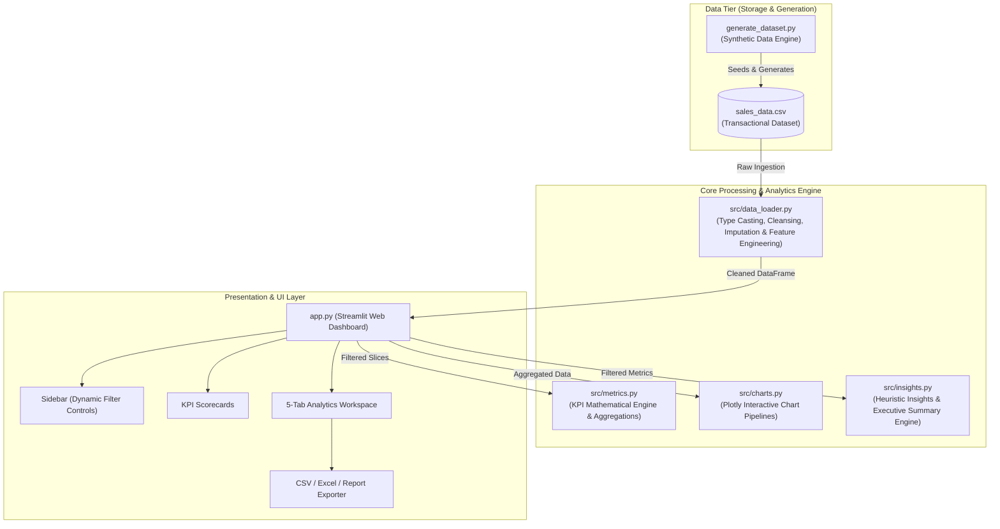
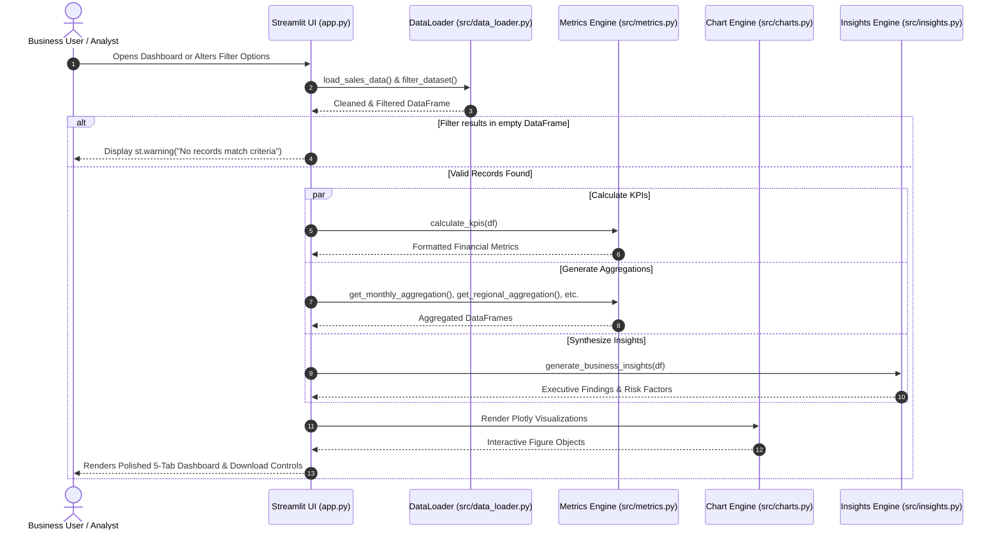

# Technical Documentation: Sales Performance Analytics Dashboard

**Project Sub-Domain:** Sales Analytics & Business Intelligence  
**Curriculum Track:** Undergraduate Artificial Intelligence and Data Science  
**Project Duration:** 8–12 Weeks Capstone / Academic Internship Submission  

---

## 1. System Architecture

The application adopts a modular, 3-tier decoupled software architecture designed for high maintainability, low latency, and separation of concerns.



---

## 2. Module Breakdown

### 2.1 `data/generate_dataset.py`
- **Purpose**: Creates realistic multi-year sales transactional records if no raw production dataset is supplied.
- **Key Logic**:
  - Implements a four-tier catalog (`Technology`, `Furniture`, `Office Supplies`, `Enterprise Software`) with realistic unit price ranges and standard margin spreads.
  - Applies a Beta distribution offset over timestamps to simulate year-over-year revenue expansion.
  - Injects seasonal weightings (Q4 end-of-year corporate budget clearance surge of +35%, summer surge of +15%).
  - Models realistic price discounting (~3.5% probability of negative margin transactions).

### 2.2 `src/data_loader.py`
- **Purpose**: Ingestion, validation, data hygiene, and feature engineering.
- **Key Functions**:
  - `ensure_dataset_exists()`: Verifies local file existence; triggers automatic generation if missing.
  - `load_sales_data()`: Reads CSV, strips whitespace, parses ISO dates to `datetime64[ns]`, casts numeric datatypes, and fills missing values.
  - `Feature Engineering`: Computes derived temporal features (`Year`, `Month`, `YearMonth`, `Quarter`, `DayOfWeek`, `IsWeekend`), boolean profitability indicator (`IsProfitable`), and binned classifications (`OrderSizeTier`).
  - `filter_dataset()`: Executes multi-criteria queries based on active sidebar selections.

### 2.3 `src/metrics.py`
- **Purpose**: Mathematical core implementing financial and sales performance formulas.
- **Key Functions**:
  - `calculate_kpis(df)`: Computes overall revenue, net profit, margin, order volume, quantity, and AOV.
  - `get_monthly_aggregation(df)`: Aggregates monthly sums and calculates Month-over-Month (MoM) growth rates.
  - `get_regional_aggregation(df)`: Computes territorial performance, average margins, and regional AOV.
  - `get_category_aggregation(df)`: Computes category shares and margin contributions.
  - `get_top_performers(df, entity_col, top_n)`: Produces ranked leaderboards for products and salespersons.

### 2.4 `src/charts.py`
- **Purpose**: Generates interactive visual charts using Plotly.
- **Key Functions**:
  - `plot_monthly_sales_trend()`: Line and area chart displaying sales velocity with average benchmark.
  - `plot_monthly_profit_trend()`: Trend chart tracking net return across operational months.
  - `plot_sales_vs_profit_monthly()`: Dual-axis clustered bar and line visual comparing gross revenue, net profit, and profit margin.
  - `plot_sales_by_region()` / `plot_profit_by_region()`: Geographic distribution charts.
  - `plot_sales_by_category()`: Donut chart displaying category market share.
  - `plot_top_products()` / `plot_top_salespersons()`: Horizontal ranking bar charts.
  - `plot_sales_vs_profit_scatter()`: Order-level scatter plot with breakeven baseline ($0 profit).
  - `plot_order_size_distribution()`: Order volume and revenue distribution across small, medium, large, and enterprise tiers.

### 2.5 `src/insights.py`
- **Purpose**: Rule-based analytical engine synthesizing raw aggregations into plain-language business insights.
- **Key Outputs**:
  - Executive summary synthesis.
  - 6 Key Analytical Highlights (Revenue Engine, Profit Champion, Territory Leader, Top Rep, Flagship Product, Peak Month).
  - Operational risk identification (quantifying unprofitable transactions from discounting).
  - Prescriptive strategic recommendations.

### 2.6 `app.py`
- **Purpose**: Streamlit application orchestrator binding the presentation, state management, and user interaction.
- **Key Design Patterns**:
  - Uses `@st.cache_data` for near-instant rendering on large datasets.
  - Employs `st.session_state` to support persistent filtering and instantaneous filter resets.
  - Implements defensive programming with graceful error handling when filtered slices contain zero records.

---

## 3. Data Flow Diagram



---

## 4. Mathematical Algorithms & KPI Formulas

The system rigorously computes sales metrics using standard financial accounting principles:

### 4.1 Total Sales (Gross Revenue)
The aggregate gross financial inflow across all filtered transactions:
$$\text{Total Sales} = \sum_{i=1}^{N} \text{Sales}_i = \sum_{i=1}^{N} (\text{Quantity}_i \times \text{Unit Price}_i)$$
where $N$ is the total count of filtered orders.

### 4.2 Total Profit (Net Return)
The total financial return after deducting the Cost of Goods Sold (COGS):
$$\text{Total Profit} = \sum_{i=1}^{N} \text{Profit}_i = \sum_{i=1}^{N} (\text{Sales}_i - \text{Cost}_i)$$

### 4.3 Overall Profit Margin (%)
The weighted operating margin achieved across the portfolio:
$$\text{Profit Margin (\%)} = \left( \frac{\text{Total Profit}}{\text{Total Sales}} \right) \times 100 = \left( \frac{\sum_{i=1}^{N} \text{Profit}_i}{\sum_{i=1}^{N} \text{Sales}_i} \right) \times 100$$
*(Note: A simple arithmetic average of individual order margins produces sample bias for orders of differing sizes; this weighted ratio accurately reflects enterprise performance).*

### 4.4 Average Order Value (AOV)
The average gross monetary value generated per completed transaction:
$$\text{Average Order Value (AOV)} = \frac{\text{Total Sales}}{\text{Total Orders}} = \frac{\sum_{i=1}^{N} \text{Sales}_i}{\text{COUNT}(\text{DISTINCT Order ID})}$$

### 4.5 Total Quantity (Volume Sold)
The aggregate count of units transacted:
$$\text{Total Quantity} = \sum_{i=1}^{N} \text{Quantity}_i$$

### 4.6 Average Profit Per Order
$$\text{Avg Profit Per Order} = \frac{\text{Total Profit}}{\text{Total Orders}}$$

### 4.7 Month-over-Month (MoM) Growth Rate
The percentage change in gross sales between consecutive monthly intervals:
$$\text{MoM Growth}_t = \left( \frac{\text{Sales}_t - \text{Sales}_{t-1}}{\text{Sales}_{t-1}} \right) \times 100$$

---

## 5. Implementation Details & Defensive Engineering

1. **Defensive Preprocessing**:
   - `pd.to_datetime(errors='coerce')` ensures corrupted date formats do not crash the engine.
   - String columns are automatically stripped of extraneous whitespace to avoid categorical grouping fragmentation.
   - Zero-division guards in metric formulas (`if total_sales > 0`) protect against NaN outputs.

2. **Session State & Filter Cohesion**:
   - Filter criteria are tied into Streamlit session state, ensuring user selections persist across tab navigations.
   - A dedicated `Reset All Filters` callback restores baseline values in one click.

3. **Performance Optimization**:
   - Data caching with `@st.cache_data` eliminates redundant disk I/O on page re-renders.
   - Scatter plots are dynamically sampled (capped at 1,200 points) to maintain 60 FPS client-side rendering while preserving representative statistical distribution.

4. **Export Engine**:
   - High-throughput CSV encoding for raw transactional analysis.
   - In-memory `io.BytesIO` binary buffering for multi-sheet Excel generation using `openpyxl`.
   - Dynamic executive narrative report generation as plain text (`.txt`).

---

## 6. Verification and Testing

The project includes an automated test harness in `test_dashboard.py` containing 8 comprehensive test cases:

| Test ID | Test Name | Tested Component | Status |
| :--- | :--- | :--- | :--- |
| `test_01` | Dataset Integrity | Checks schema columns, non-null constraints, and volume | **PASS** |
| `test_02` | Derived Features | Validates temporal and tier feature creation | **PASS** |
| `test_03` | KPI Calculations | Asserts exact mathematical match for Sales, Profit, Margin, AOV | **PASS** |
| `test_04` | Filtering Logic | Validates multi-criteria intersection filtering | **PASS** |
| `test_05` | Aggregations | Checks grouping logic across temporal, regional, and category dimensions | **PASS** |
| `test_06` | Chart Generators | Validates rendering pipeline for all 10 Plotly figures | **PASS** |
| `test_07` | Insights Generation | Validates executive summary, risk calculation, and recommendation synthesis | **PASS** |
| `test_08` | Empty Filter Safety | Confirms graceful zero-handling when no records match filter criteria | **PASS** |

**Execution Result:**
```
Ran 8 tests in 0.594s
OK (8/8 Passed)
```
